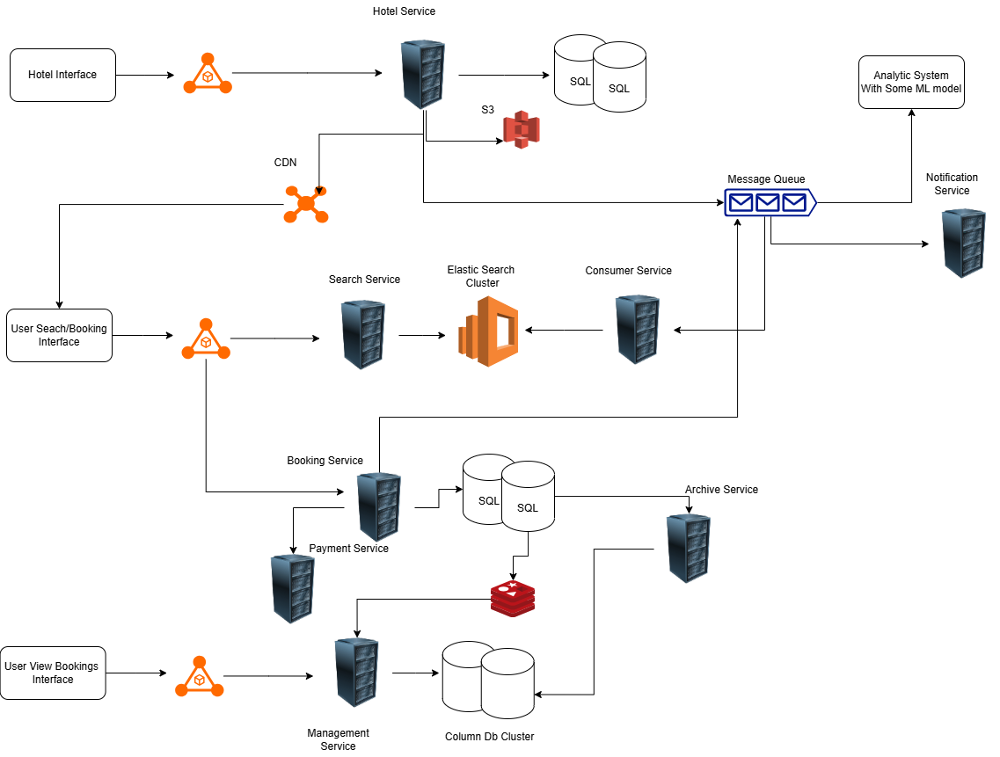

## Booking System

Some of the functionality taken care

- Booking
- Search
- Status Check
- Analytics

The booking system design provides different interfaces for hotel and user.
For hotel, the hotel service is responsible to update the hotel related information in the sql cluster and the images or other media is stored in blob storage and to the cdn for reduced latency.

The user interface provide a search option based on which the hotels are shown. The filters are passed to through the routes and then an elastics search cluster is used to get the search options is case of fuzzy search.

The booking service interacts with the payment service and the status and booking information is stored in the sql cluster database and the messages are pushed to a message queue in case of bookings or payment updates so that the archive service is updated and then it can update the bookings data to redis and column database(cassendra) so that the booking view screen can be populated.

The cassendra is used to reduce the latency in case of read heavy system and the notification service is used update the user about the different status of booking. For detailed notification service check this out [NotificationService](../hld/notification.md)

Lastly, the messages queue is polled by an analytic service on top of which the machine learning model is run to get the user insights and more real time driven actions can be take by the system let's say for example update of prices in case of high traffic and others.

### Booking on Cloud
In case of loadbalancer and alb can be used in case of aws or api gateway to have an inbuilt features. The message queue can be used as SNS or Azure Service Bus. The RDS or azure sql service can be used in case of sql databases and for column database, dynamo database in case of aws and cosmos database in case of azure.