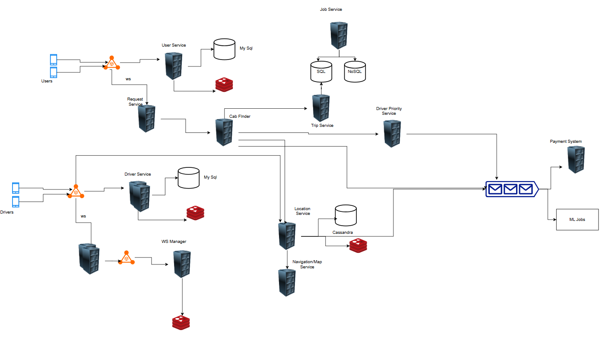
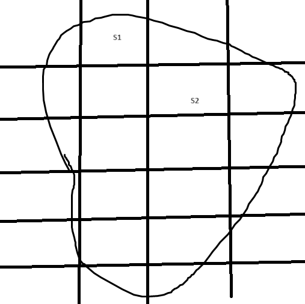

## Cab Booking Design

The cab booking design is below with basic functionality like

- Book a Cab
- Location Tracking
- ETA 
- Price
- Global User
- Highly Avilable, Consistent and Low Latency

For a cab service, generally the area is divided into segments and based on the segment the location is traked and nearby segments cab are searched.
The user and drivers interacts with their own interface and user service is responsible for saving user info and similarly cab is responsible for cab information.
Both the user and driver uses web socket communication for bidirectional system.

Each driver is connected to websocket connection through web socket handler service which is managed by web socker manager using redis database to determine which driver is handled by which handler.
Each driver will periodically sends its location which will be updated in a nosql cassendra database. Using this location we would be able to track the driver and also in the case of trip we can determine the actual distance drive to calculate the price.
Location service talks to navigation/maps service to detemine the ETA using the segment concept.
Using maps service location service will determine which segment is the driver in and that information is stored in redis so that we user books a cab we get to know which all drivers are in nearby segments.

Whenever user request the book, the cab finder service talks to location service to determine the drive in the location using the user location or segment and using websocket the driver and user is informed about the trip.
The nearby segments are picked and the nearest cab driver can be picked for the trip using the driver priorty engine based on user and the driver.
The trop service is responsible maintain the trip information and also the status of the trip which uses sql to store the current running information as it would be structured data and transaction would be required also same data is saved in cassendra for heavy reads.

The data from cab finder is goes to message queeu to intiate the payment once the trip is finished.
The Location Service and Driver Priority Service puts a message to build a reporting and machine learning system.

### Cab Booking On Cloud
