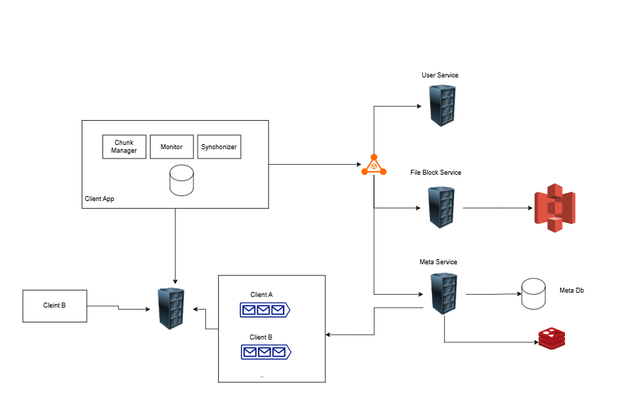

## FIle Sharing Design

Some of the functionalities which are taken care are

- Upload a file
- Update the file
- Multiple User Update
- Offile User

The file sharing works on the workspace management, the workspace contains the files and user.
The client has majorly three components, the chunk manager which is responsible for dividing the file into chunk lets say 4MB so that data can be pushed easily and in case of chunk lost the whole file is not reuploaded.
The other componet is monitor which monitor the file changes and determine its metadata. The synchronizer component is used to synchronise the local changes with the actual cloud storage system.
The client app contains the sqlite database which stores local meta data in case of offline client changes and determine the chunk bytes range.

Whenever the file is uploaded, the file request goes to file block service and it consildates the data and save it in a storage like s3 and then the meta service is responsible for updating the metadata about the file to the sql database.

Whenver the file is updated, the file chunk is updated and block service validates the chunk using checksum integrity and the file is updated also the meta service updates the meta database which helps in determining the file information permissions, ownership etc.

Once the request is updated the meta service updates the message queues of the each client in the workspace so the latest changes can be reflected to each client. The messages are pushed to notification service which then pushed the new changes to each client. The client can do a long pool to get the new changes.

### File Sharing On Cloud 
