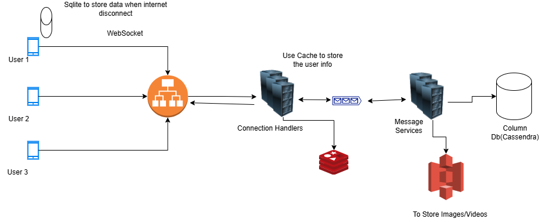

# Messaging

The messaging design is below with basic functionality like send message, message status.

The websocket connection or protocol is required to do the communication so that the infomation can be bidirectional.
The connection handler will be used to send the messages and to the designated user which uses Redis database to store the user information and it would contain a cache which can be used reduce the redis calls and share the details with message service which will save the information in the column database like cassendra, which is designed to store the message related information.
A storage is used to save the information like images, videos etc.
For message status once the information is reached to connection handler the status can be updated to sent and once the message is recieved to the user we can update the status to message sent.

The connection handler will communicate which user is avilable or not.

## Cloud

In case of cloud services we can use api gateway instead of load balancer and which can be directly connected service queues like sqs (AWS) or ASB (Azure) and api gateway will directly communicate or store messages in this case and we can use lambda or azure functions for the processing.