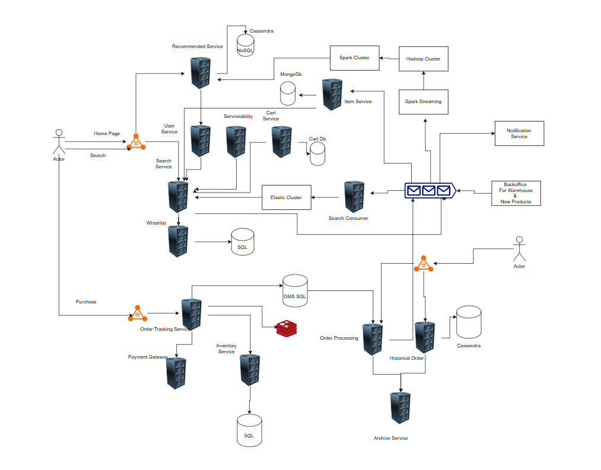

## Booking System

Some of the functionality taken care

- Seach
- Add to Cart/Whislist
- View Orders
- Checkout
- Highly Available, Low Latency and High Availability

The input to the system is the warhouse and new products backoffice service which is used to input the new items which will used by item service and saved in mongo database and warhouse information is used by serviceability service to filter the products on the user search list based on the product deliver address.

The user search gets data from search service which is build on top on elastic search for fuzzy search and other search capability. Whenever a new product is added it is consumed by search consumer and make it available for the search.

And the search is product metrics is input to message queue and using spark clustering, hadoop cluster and ML jobs are used to build the recommendation of the user based on different categories.
The user can whislist the item which is saved in a sql database.

The serviceability service will have all the logistics and warehouse information prebuild from backoffice service input so that searched item can be filtered and no runtime logic is required.

Whenever used add the item in the cart, the cart service saves that information in cart sql database

When user checkout and purchase the product, the order tracking service sends the request to payment gateway and save the data in the redis with a timeout and waits for the payment gateway for the response and order blocks the inventory so that race conditions are not created.

There a couple of scenarios, when the transaction is failed the inventory is unblocked and the order is updated.
In case when the reponse is not got from payment gateway and redis pushes the timeout the order status is updated.
But in case of timeout and we receive the reponse of success from payment gateway then we can create a new record based on the scenario of refund the amount to user.

All these status and information is pushed to order processing service which is then achieved and saved in cassendra for heavy reads and it is used by view orders flow using the historical service and order processing service.

Once the order is processed successfully or any other status, the input is provided to message queue using which the recommended system is build and also notification is sent.

### Shopping on Cloud
