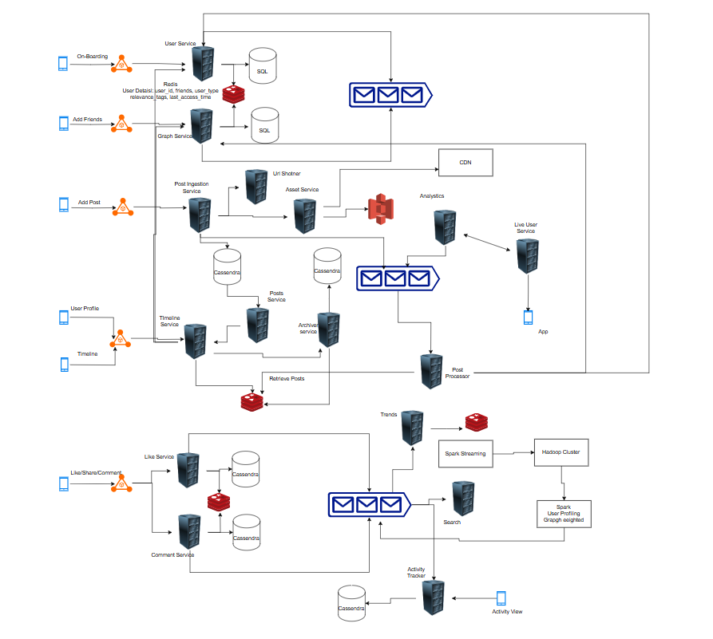

## Social Platform Design

Some of the functionalities which are taken care are

- Post Content
- Like, Comment and Share
- Add Friends
- View Timeline
- View Profiles
- Activity Log
- Scalable, Global, Read Heavy, Fast Rendering and With Access Pattern

There are different view which user can access.
The initail onboarding is done with user service and a sql database which will store the user information and when user adds a new friend it is stored in a seperate sql database, we can use graph database also. The is stored in redis also for faster access.
The user service and graph service pushed to a message to a message queue in case of system update.

There are couple of users like active, inactive, famous, Passive, Live. The status are used to build the timeline. Also user information has relevance tag based on which the timeline will be shown.

When a user post a record, the post ingestion service will talk to short url service to create a short url and asset service to save the blob inforamtion to s3. The asset service takes care of creating the media docs for different devices and also it takes care based on the last time retrieval or frequent retrieval to move the image from s3 to cdn for faster availability.
Then the post is saved in cassendra from timeline generation. Since it will be a heavy read system cassendra is used.
After creating a post it will send a message to message queue. One consumer would be live user to show then the new posts to their friend using websocket. The analytics service works whenever a new post is added to add the relevance tag using ML models.

The post processor service listens to the messages and using the post with relevance tag and using user service and graph service it will build the posts and the frieds on whose timeline posts should be visible. The content is pushed to redis and from redis the timeline service fetches the information from post service, archive service and redis.
The archive service is used by timeline service and it also free up the redis for latest content.
The user profile and timeline is shown using the timeline service.
The timeline service will build up the timeline based on the user type so that the load is maintained.

For like and comment the post is information is saved in cassendra and redis for faster retrieval and the message is pushed to queue which is used activity service to track all the activity and also by spark streaming system which is used to build the user profiling and the weighted friend based on the user like and comment the connections are weighted and top of it trends are created which are saved in redis. The user profiling builds the weights and pushed a message to queue which will update the user information and its friends weight.

### Social Platform On Cloud 
