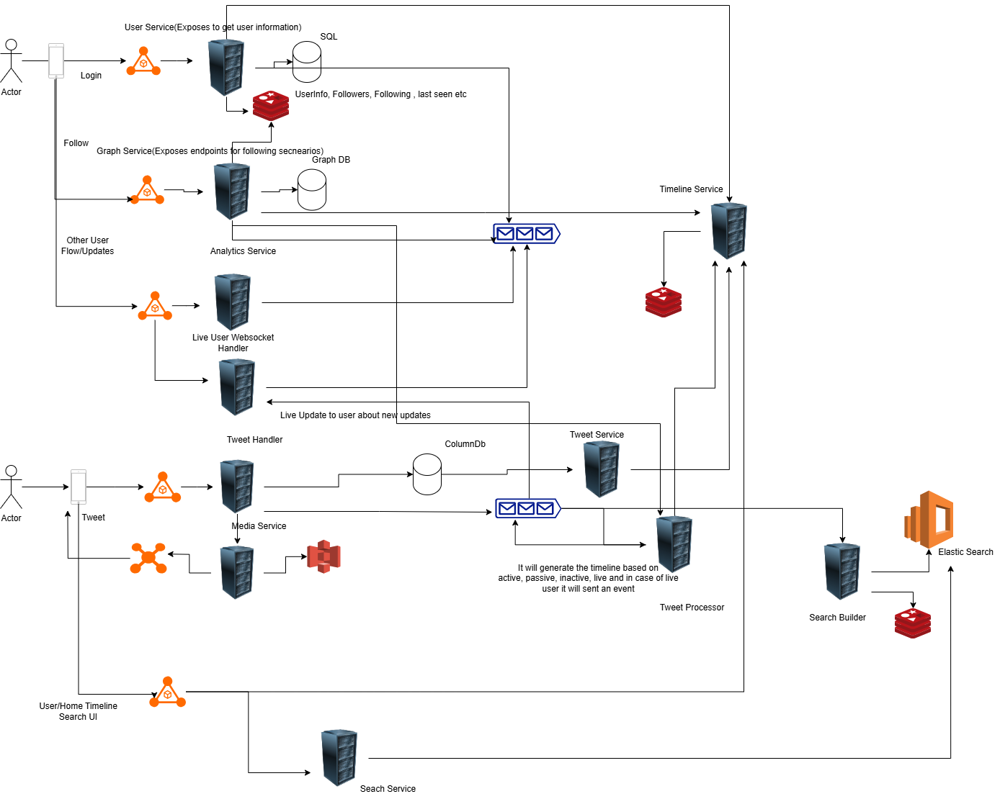

## Twitter Design

Some of the functionalities which are taken care are

- Tweet
- Search
- Follow

Twitter is a read heavy system which requires a high scalable system. To design it, the system requires classification of the users based on which the timelines can be determined. Users are classified as famous, active, inactive, passive, live.

To login the user a sql database can be used to store the data and the cache can be done on redis. Similarly the users followers and following information can be stored in a graph database which will also save the user information, its followers, following, type and last seen based on which the timelines can be build.

To provide tweet functionality, the tweet service uses column database which can be cassendra and all the tweets related information can be stored in it as it provides heavy read. Tweets related media can be stored in S3.

There is a websocket connection open using which the live users can be updated.
To build the timelines, the timeline service and the tweet processor precalculate the active user timelines in redis. Tweet processor determine if the user is live, active or active and based on it builds the timeline.In case of people whose followers are big we will send the update to only user who they follow are famous and this would be take care by tweet processor service.

To provide the seach functionality the elastic service is used which is feeded using the cassendra database.
All the inputs to the services are event based and the message queues are used to decouple the services and act as in input to the multiple service.

Scaling of message queue, column db and redis is really important in this design to handle heavy load.

### Twitter On Cloud 

To design the system with AWS/Azure, the api gateway can be used as a load balancer which will helps in intergrating with the services based on the path. The Message queue can be used as SQS/Azure Service Bus and dynamo/cosmos database can be used to store the tweet information.
The servers can be replaced with EC2 and in case of serverless azure function/aws lambda can be used with step function to trigger different flows