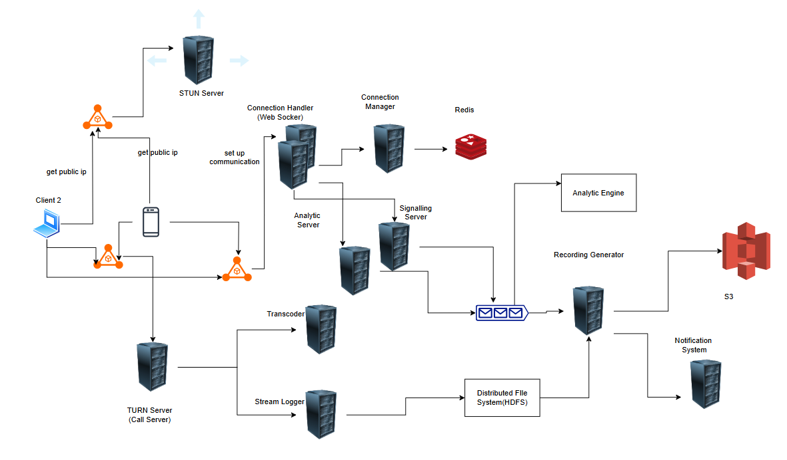

## Video Conferencing System

Some of the functionality taken care

- One to One Call
- Group Calls
- Video Share
- Recording

The video confrencing application should be build on WebRTC protocol which is feasible for the sceanrio which provides high speed but data loss can be trade off.

There are mangerly three componenets, the websocket handler, STUN server and TURN server.
The STUN server is used to determine the public ip address of the clients through which the UDP connection can be made.
The TURN server is used as a call server after determining the setup and public ip addresses.
The websocket handler is used to exchange the details like the network info, streaming info etc.

The websocket handler is connected web socket manager using a redis database which is used to get the information of other connected users.

When user 1 wants to call a user 2 it sends a request to websocket handler which is there connected to signalling service which is resposible for connected the user if possible, let say if the user is not allowed to connect to other user all that logic resides there.

In happy path, the signalling service will inform web socket handler or another user if user wants to connect to other user and signalling server which inform the websocket handler that the user has accepted the call.

Then the STUN server will provide the public ip address of the users and then using the websocket handler and signalling service they will tell the public ip addresses of each other.

Now the TURN server is used to do a further communication which is connected to a logging service and also the transcoding service.
Using Transcoding service it maintains the bandthwidith and other aspects of the video based on the users requirements and logging service is used to log the video which is used to save the recording.

Once the call is call is completed using the signalling that it is completed and it will put an event to message queue and then the recording file is created and pushed to S3 and then using notification service it notifies the user about the recording.

The communication can be done using the public address or the TURN server and they can switch the communication.

### Video Conferencing on Cloud
