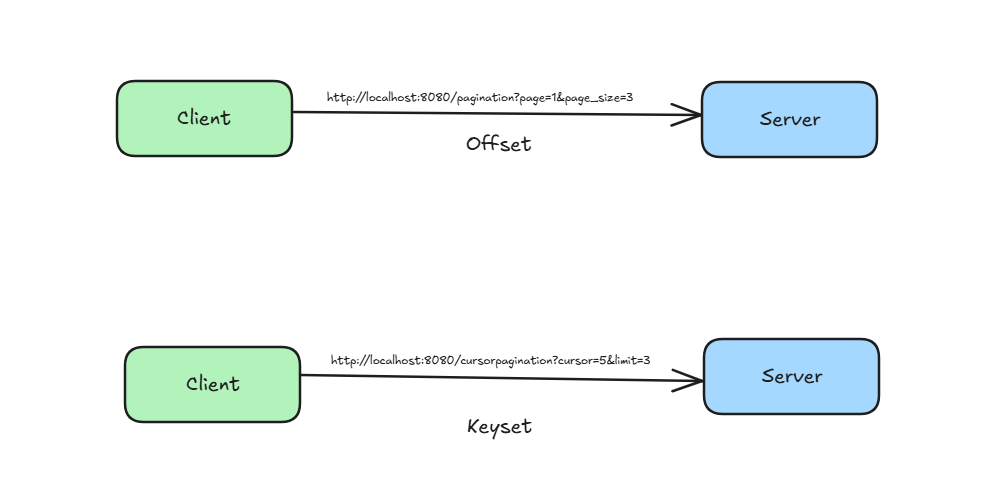
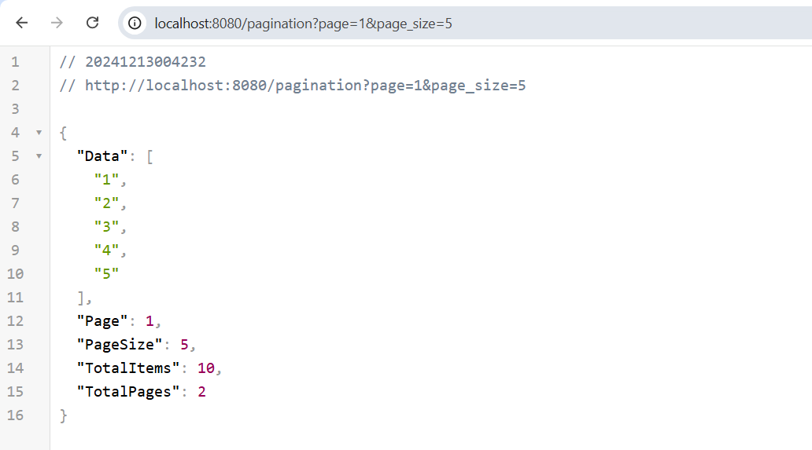
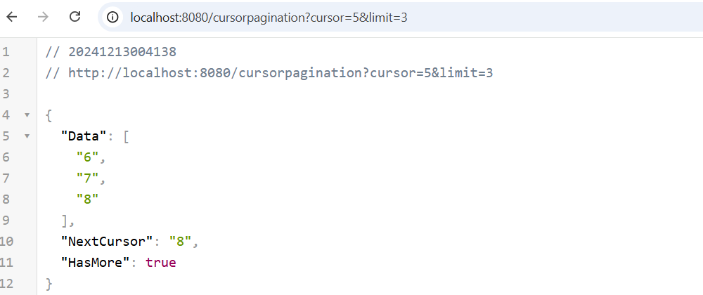

# API Response - Offset & Keyset

To run the service use below command

```
go run pagination.go cursorpagination.go
```



Offset Pagination - is the concept where the page no and page size needs to be send by the client and based on the api response would be.

```
http://localhost:8080/pagination?page=1&page_size=3
```



Keyset Pagination - is the concept where the response would tell if there are more results and in the subsequent calls the result can be fetched using the cursor.

```
http://localhost:8080/cursorpagination?cursor=5&limit=3
```


