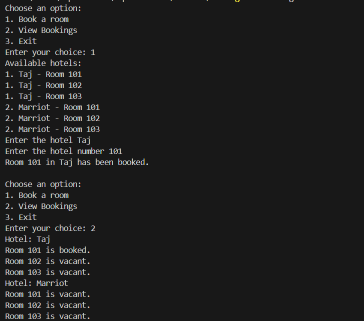

### Booking LLD

This repository demostrates the low level design for the booking system.
To view high level design. Check [HLD](../../hld/booking.md)

Routes which can be used for hotel interface

```
POST /hotels
GET /hotels/{id}
PUT /hotels/{id}
POST /book
GET /bookings
```


Output:



View the implementation. [Repository](../../code/booking/booking.go)

More scenarios can be integrated with the system like filters name location and concurrent scenarios. 