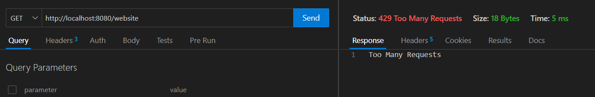

## Gateway - Rate Limitor

This repository represents the implementation of a gateway with a rate limiting feature.
The rate limiting feature can be implemented with different algorithms

- Token Bucket
- Leaky Bucket
- Fixed Window
- Sliding Window
- Sliding Window Log


Here we have used token bucket alogrithm.

The repository contains backend server which can be run.

1. Go to ```code/backend``` folder
2. Run the backend or run as a part of gateway
3. Once you run the gateway and backend the services and gateway would be up.


The gateway will redirect the request based on the url path.


The request is intercepted and rate limitor validates if the request is allowed or not.
The rate limitor fills the tokens at an interval and with a limited capacity and based on it allows the request to be routed to a specific server else it will response with ```429 Too Many Request```.




