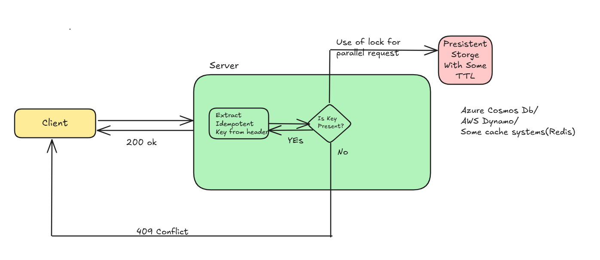
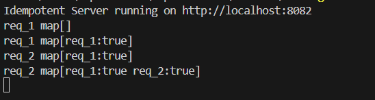
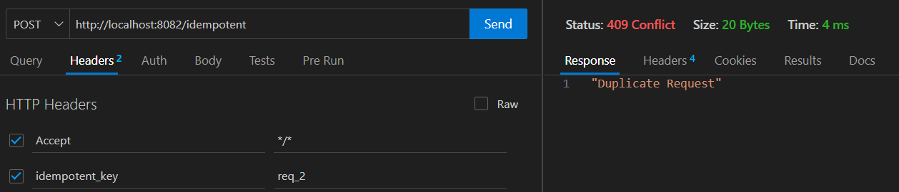

## Idempotent Design

This repository demonstrates the idempotent system where the request were validated before the execution in case of sequential or a parallel call. In case of timeout from the server or a retry could lead to duplicate request. 

Below the example where request would be successful but when in case of duplicate request the client would get a conflict http status code.

The request would contain an idempotent key which will be used to validate the request.
Here we have used a in-memory for the demostration but in real scenario a database or a cache system can be used.

