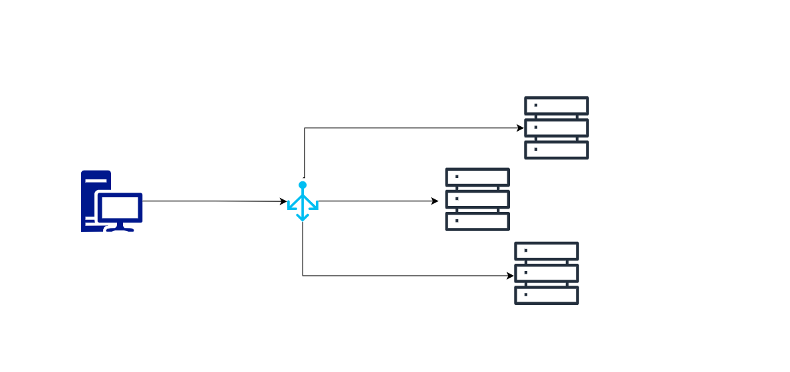

# Load Balancer Implementation

The loadbalancer is implemented in go using httputil package where the number of backends are set and then using a round robin strategy the requests are forwared to the different backend servers.
