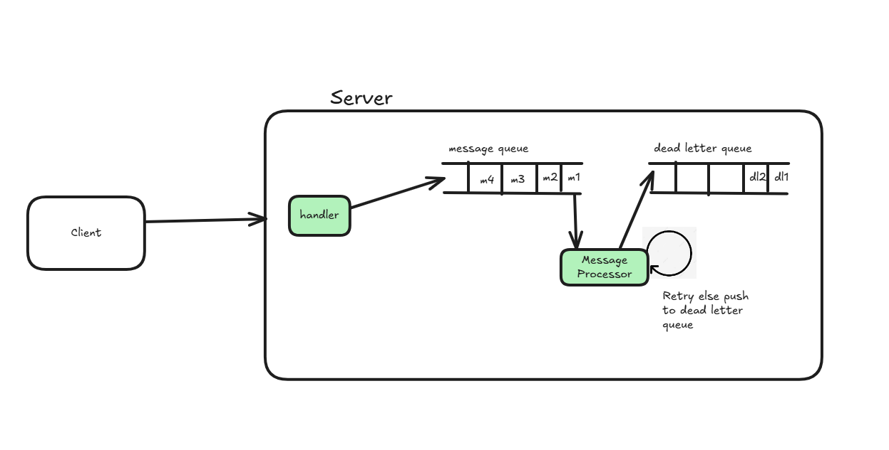
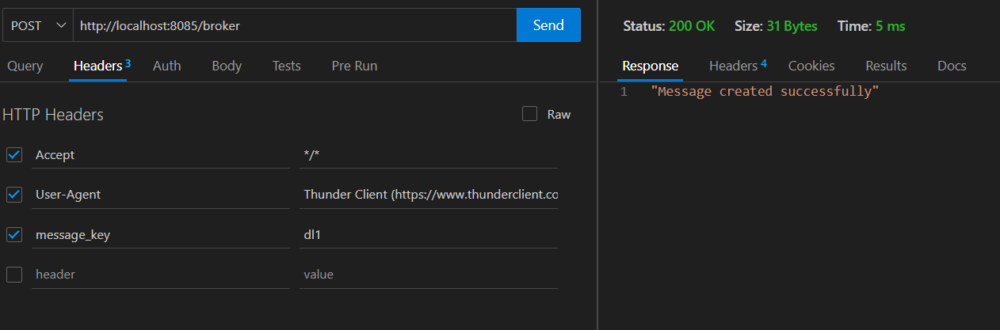
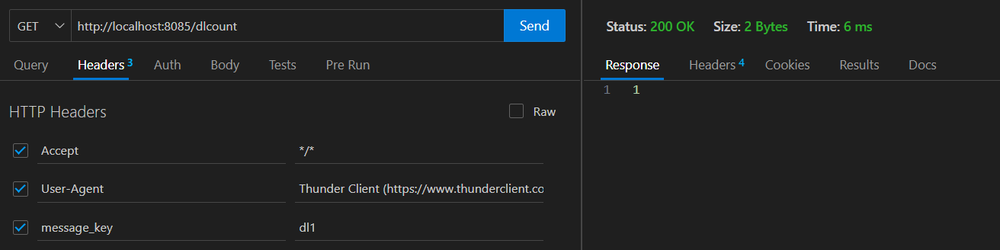
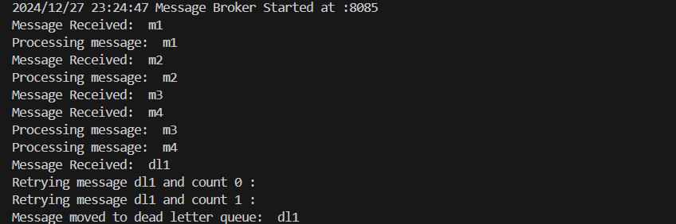

## Message Broker

This repository demostrates the low level design to implement a message broker. 
The message broker contains two queues, on receiving a request from client the message is handled and saved in a queue which is processed by another handler.



The message handler validates the message and if there is any error it has a retry mechanism using which it retries the message over a particular period of a time and this time also gets delayed.

```
https://<service-name>:8085/broker
https://<service-name>:8085/dlcount
```





Once the retry counts exceeded the message is moved to a dead letter queue which can be used to validates the messages.



The further implementation can be done to move the messages from dead letter queue to message queue.


View the implementation : [Repository](../../code/message-broker/messagebroker.go)
