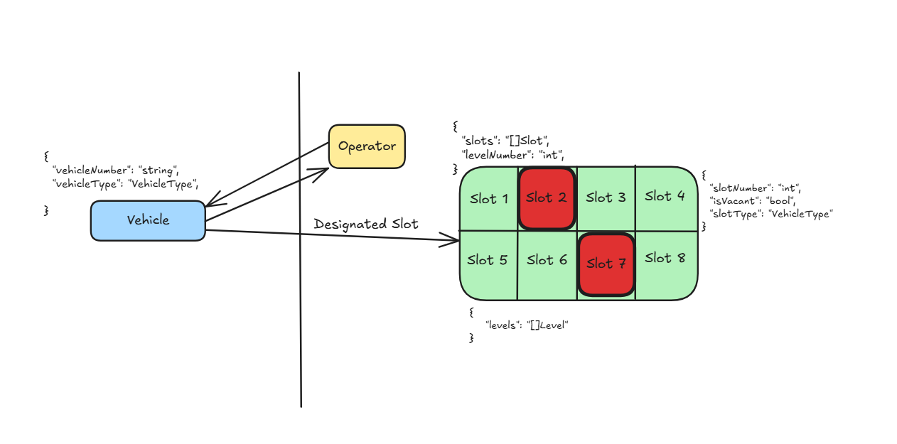
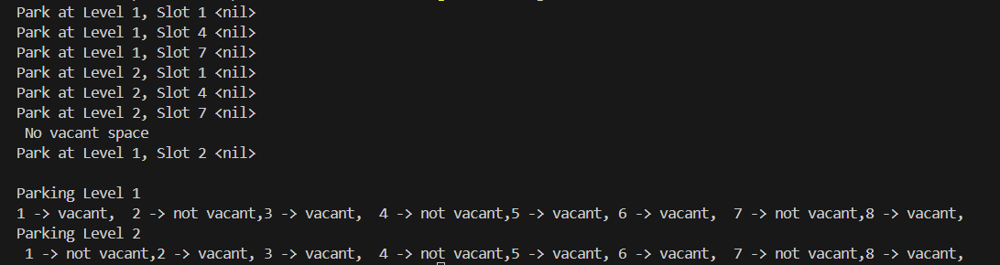

## Parking Lot LLD

This repository demostrates the low level design to implement a parking lot. This parking lot system contains the levels and slot in the parking and each slot can occupy a specific type of vehicle.

The vehicle type is determined and a slot number is given to park the vehicle and in case of no spece the vehicle cannot be parked.

View the implementation : [Repository](../../code/parking-lot/parking.go)
