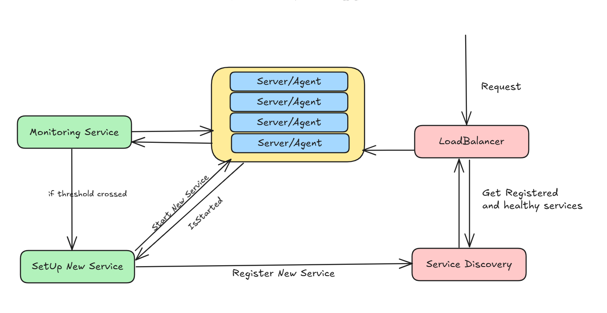

## Scaling - Monitoring Agent

This repository demostrates the monitoring agent which will be used to scale the services based on the threshold.
This is used to the containerized system which uses docker under the hood.

The monitoring agent will be a part of the server its self and which will send the metrics of the running containers to the monitoring service, which will check the memory usage against the threshold which user can set using some using interface.

The monitoring service will then based on the threshold limit if it exceeds it will set up the services and start a new service or it will send the service configuration to the existing server to spin a new container which then uses the [ServiceRegistry](https://github.com/arpitfs/service-discovery) to register itself so that the new requests can be sent. The [LoadBalancer](../../lld/load-balancer/loadbalancer.md) will try to get the services which are running and then new requests is forwarded to the new running service. 

# Cloud

Similarly this can be integrated with cloud where while start the new service, the configuration can be send to azure or aws using the sdk's and the new services or infrastructure can be created based on the complexiting and the pooling system can be created to determine the successful creation of infrastructure and based on that the services can be registered to service discovery.

View the implementation. [Respository](../../code/scaling/agent.go)