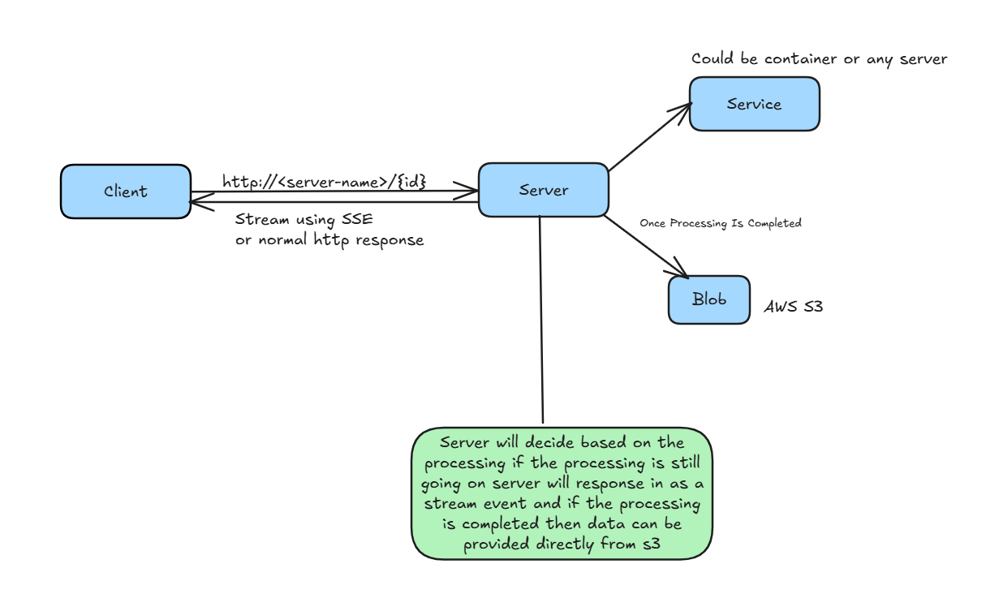

## Data Streaming

This repository demostrates the streaming system using two backend patterns, normal request/response and server stream events.
The data can be fetched from a server.
Here in the example we have assumed that some docker container is streaming the logs and to replicate we initiated a thread to write some logs in a file.
In a similar fashion the data can be fetched and a flag can be mainted is the process is completed then normal response can be sent and the file can be saved in some blob storage like S3.
If the process is not completed the server stream events pattern can be used to see the real time streaming of data.

View the implementation: [Repository](../../code/data-streaming/streaming.go)