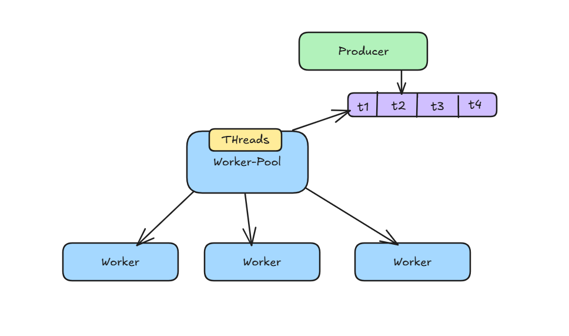
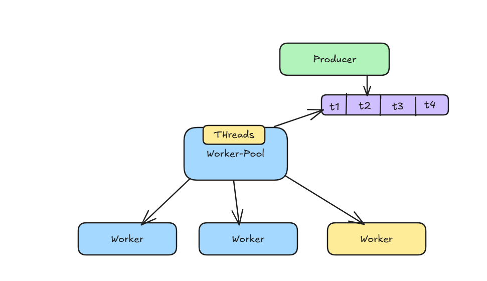

## Worker Pool

This repository is a demostration of creating of working pool which will help in managing the threads to use the resources optimally.
The producer is responsible for creating the jobs which are stored in a queue.

The queue is monitored and a new thread is created to process the job, there is a limit for creating the new threads and this thread management is done by go scheduler in this case.

You can read more about go scheduler in the document. [Link](https://arpitfs.medium.com/threads-management-in-go-3df67393af99)

The new thread does the work and do a signal that the thread is released such that the new threads can be created

View the implementation: [Repository](../../code/worker-pool/startup.go) 